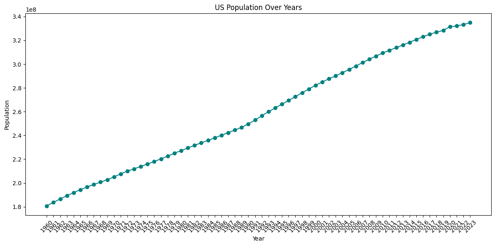
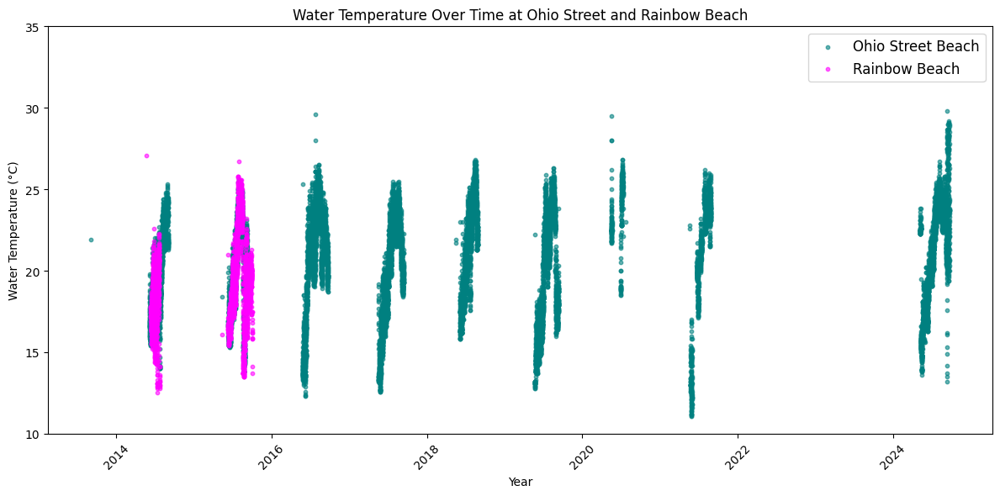

# Project 2: Visualizing  Datasets

## Plot 1

The data I have plotted above shows the annual population of the United States between 1960 and 2023. I found this data on the [awesome-json-datasets](https://github.com/jdorfman/awesome-json-datasets?tab=readme-ov-file) github repository under the 'Population' heading for [USA](http://api.worldbank.org/countries/USA/indicators/SP.POP.TOTL?per_page=5000&format=json). The plot illustrates the upward trajectory from a population of 1.8 million in 1960 to today's population of roughly 3.4 million.

## Plot 2

I also created an additional plot from a dataset on beach water quality in Chicago from [Data.Gov](https://catalog.data.gov/dataset/beach-water-quality-automated-sensors). The data looks at several beaches along Chicago's Lake Michigan lakefront, recording hourly sensor outputs in the water. While sensors are active throughout the summer, during other seasons and at some other times, information from the sensors may not be available. This explains the irregularity of observations across time in my scatter plot above. 

**To learn more about this assignment, visit the [project instructions page](https://github.com/mikeizbicki/cmc-csci040/tree/2025spring/project_02_visualizing_datasets).**